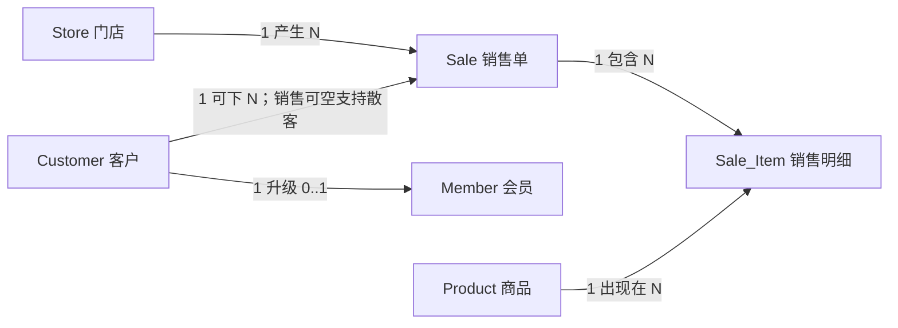
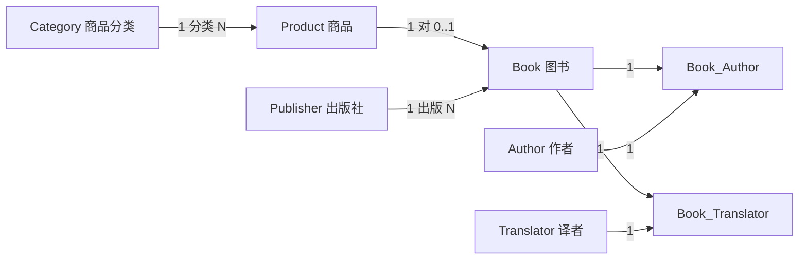
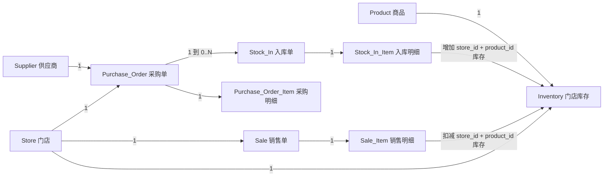
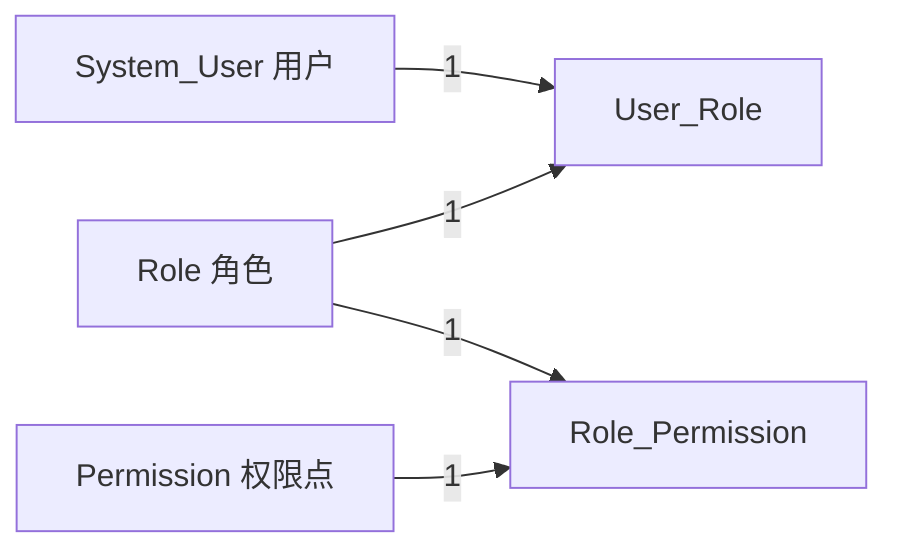

# 网上综合书店销售数据库项目
## ER 图设计说明（与 PPTX 对齐版）

> 本文档用 Mermaid 拆分展示核心销售、商品图书、权限、采购入库与门店库存关系。
> 对齐来源：`pre/网上综合书店销售数据库_展示(6).pptx` 第 13-19、23-24 页。

---

## 1. 图例说明

- 实体：矩形节点
- 联系：带文字的连线
- 基数：使用 `1`、`N`、`0..1` 表达
- 中间表：用于把多对多关系转为两个一对多关系

---

## 2. 子图 A：销售业务主链路

---

## 3. 子图 B：商品与图书域

---

## 4. 子图 C：供应关系

---

## 5. 子图 D：分类自关联

---

## 6. 子图 E：库存 + 销售 + 采购

---

## 7. 子图 F：权限控制

---

## 8. 关键设计说明

- `Product` 只保存商品通用信息，库存移动到 `Inventory`。
- `Inventory` 的主键为 `(store_id, product_id)`，支持连锁门店各自维护库存和安全库存。
- `Purchase_Order` 表示向供应商下单，`Stock_In` 表示到货验收；二者分离以保留采购和入库过程。
- `Sale_Item` 不直接存库存结果，只作为库存扣减来源；实际库存状态由 `Inventory` 保存。
- `System_User`、`Role`、`Permission` 与两个中间表组成数据库层面的 RBAC 模型。
