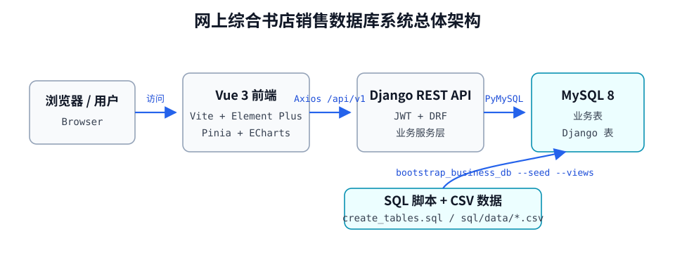
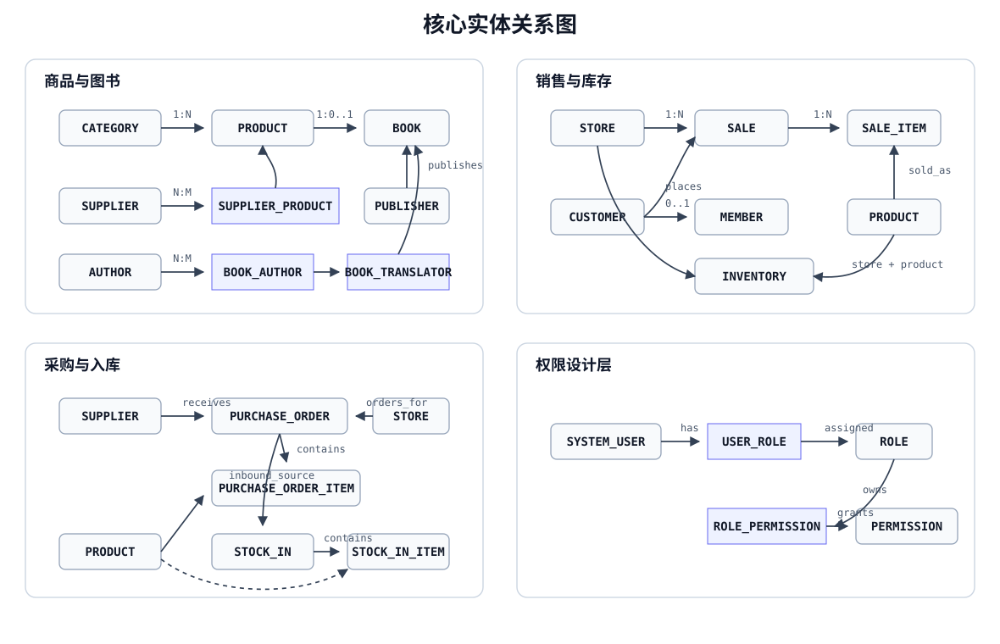
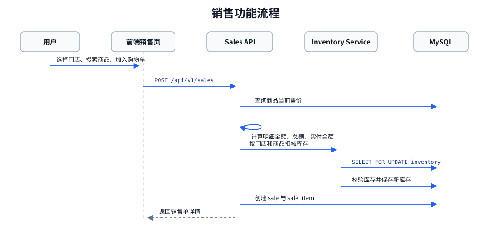

# 网上综合书店销售数据库系统项目文档

仓库地址：`https://github.com/Loong-C/FDU-Database.git`

线上地址：

- `https://linkukai.com/bookstore/`
- `https://www.linkukai.com/bookstore/`

## 1. 项目概述

### 1.1 项目定位

本项目是一个用于数据库课程作业与演示的网上综合书店销售数据库系统。系统围绕连锁书店日常经营数据展开，覆盖门店、供应商、分类、商品、图书、出版社、作者、译者、客户、会员、销售、库存、采购、入库、用户权限和统计分析等业务。

系统采用前后端分离架构：

| 层次 | 技术与内容 |
|---|---|
| 前端 | Vue 3、TypeScript、Vite、Vue Router、Pinia、Element Plus、Axios、ECharts |
| 后端 | Python、Django 5.2、Django REST Framework、PyMySQL、PyJWT |
| 数据库 | MySQL 8，业务表由 `sql/create_tables.sql` 维护，演示数据由 `sql/data/*.csv` 导入 |
| 部署 | README 中记录线上部署使用 Ubuntu VPS、Nginx、Gunicorn、Let's Encrypt HTTPS，访问子路径为 `/bookstore/` |

当前项目的部署地址为：

- `https://linkukai.com/bookstore/`
- `https://www.linkukai.com/bookstore/`

### 1.2 系统目标

1. 建立符合关系数据库规范的综合书店销售数据库。
2. 将商品通用信息、图书专有信息、门店库存、客户会员、销售采购等业务实体清晰拆分。
3. 使用主键、外键、唯一、非空、CHECK 等约束保证业务数据完整性。
4. 提供后台管理界面，使演示用户能够完成基础资料维护、销售开单、库存调整、采购入库和统计分析。
5. 使用 JWT 与角色字段实现运行时权限控制，并保留 SQL 设计层 RBAC 表。
6. 支持通过 SQL 脚本和 CSV 数据一键重建演示数据库。

### 1.3 系统边界

当前系统重点覆盖以下内容：

- 基础资料管理：门店、供应商、分类、出版社、作者、译者。
- 商品管理：普通商品、图书档案、供应商供货关系、初始门店库存。
- 客户会员：客户资料、会员编号、会员等级、积分字段维护。
- 销售业务：销售单、销售明细、门店维度库存扣减、销售删除回补库存。
- 采购入库：采购单、采购明细、入库单、入库明细，入库审核后增加库存。
- 库存管理：门店-商品库存、安全库存、低库存预警。
- 统计分析：门店日销售、商品排行、会员消费排行、分类汇总、库存预警等。
- 用户与权限：演示账号、JWT 登录、访问令牌刷新、角色菜单与后端权限。

## 2. 系统需求分析

### 2.1 用户角色

系统运行时使用 Django 自定义用户 `accounts.User.role` 控制角色，角色类型定义在 `backend/accounts/models.py` 和 `frontend/src/api/types.ts` 中：

| 角色 | 英文值 | 说明 |
|---|---|---|
| 管理员 | `admin` | 可维护基础资料、商品图书、库存、采购入库、销售和用户账号 |
| 操作员 | `operator` | 可维护客户、会员、销售、采购、入库等业务数据；后端允许读取部分基础资料 |
| 查询用户 | `viewer` | 前端主要开放欢迎页、经营总览和统计分析；后端 `InventoryPermission` 也允许读取库存接口 |

演示账号由 `python manage.py seed_demo_users` 创建：

| 用户名 | 密码 | 角色 |
|---|---|---|
| `admin` | `Admin123!` | 管理员 |
| `operator` | `Operator123!` | 操作员 |
| `viewer` | `Viewer123!` | 查询用户 |

### 2.2 功能性需求

| 模块 | 功能需求 | 当前实现位置 |
|---|---|---|
| 登录认证 | 用户登录、刷新令牌、注销、获取当前用户 | `backend/accounts`、`frontend/src/stores/auth.ts`、`frontend/src/api/auth.ts` |
| 用户管理 | 管理账号、角色、启停状态、密码 | `UserViewSet`、`frontend/src/views/system/UserListView.vue` |
| 门店管理 | 门店增删改查，按城市、名称筛选 | `stores` 后端 app、`StoreListView.vue` |
| 供应商管理 | 供应商增删改查，维护联系人、电话、邮箱、状态 | `catalog.Supplier`、`SupplierListView.vue` |
| 分类管理 | 商品分类树，自关联父分类 | `catalog.Category`、`CategoryTreeView.vue` |
| 出版社管理 | 出版社资料维护 | `catalog.Publisher`、`PublisherListView.vue` |
| 作者/译者管理 | 作者和译者资料维护 | `catalog.Author`、`catalog.Translator`、对应前端页面 |
| 商品管理 | 普通商品维护、分类、售价、成本价、条码、状态、供应商关系、初始库存 | `ProductViewSet`、`catalog/services.py`、`ProductListView.vue` |
| 图书管理 | 图书作为商品子类维护 ISBN、出版社、出版日期、版次、语言、页数、作者、译者 | `BookViewSet`、`BookFormDrawer.vue`、`BookListView.vue` |
| 客户管理 | 客户资料维护，标识是否会员 | `customers.Customer`、`CustomerListView.vue` |
| 会员管理 | 基于客户创建会员，维护会员编号、等级、积分、入会日期 | `customers.Member`、`MemberListView.vue` |
| 销售管理 | 销售单列表、详情、新开销售单、自动计算金额、扣减和回滚库存 | `sales` 后端 app、`SalesCreateView.vue`、`SalesListView.vue`、`SalesDetailView.vue` |
| 门店库存 | 查询库存、按预警筛选、调整当前库存和安全库存 | `inventory` 后端 app、`InventoryListView.vue` |
| 采购单 | 创建、修改、查询、删除采购单和明细 | `procurement.PurchaseOrder`、`PurchaseOrderListView.vue` |
| 入库单 | 创建、修改、查询入库单，审核通过增加库存 | `procurement.StockIn`、`StockInListView.vue` |
| 经营总览 | 今日销售额、订单数、最高消费会员、低库存预警、近 7 日趋势、分类占比、热销商品 | `DashboardView.vue` |
| 统计分析 | 门店日报、商品排行、会员消费、分类汇总，支持筛选和 CSV 导出 | `analytics` 后端 app、`AnalyticsView.vue` |

### 2.3 非功能性需求

| 类型 | 需求与当前实现 |
|---|---|
| 可维护性 | 后端按 Django app 拆分；前端按 `api/components/layouts/router/stores/views` 拆分；SQL、CSV、文档独立目录管理 |
| 数据完整性 | SQL 脚本定义主键、外键、唯一、非空、CHECK 约束；后端 serializer 补充字段校验 |
| 一致性 | 销售、采购、入库、库存变更使用 `transaction.atomic()` 和 `select_for_update()` 处理 |
| 可扩展性 | `product` 作为父表，`book` 为共享主键子表；库存独立在 `inventory`，便于扩展多门店 |
| 安全性 | JWT Bearer Token 鉴权；refresh token 存储 SHA-256 hash 并支持轮换和注销 |
| 可测试性 | `backend/common/tests.py` 覆盖登录、权限、业务 CRUD、库存生命周期、统计接口和异常场景 |
| 可部署性 | 前端可构建为 `dist/`，Django 在生产模式可回退服务 `frontend/dist/index.html`，README 记录 Nginx/Gunicorn 部署方式 |

### 2.4 关键业务规则

1. 商品必须属于某个分类。
2. 图书必须同时存在 `product` 和 `book` 记录，二者共享 `product_id` 主键。
3. 图书必须至少设置一位作者，`catalog/services.py` 在创建和更新时校验。
4. 客户可升级为会员，`member.customer_id` 与 `customer.customer_id` 共享主键。
5. 销售单必须绑定门店，客户可为空以支持散客。
6. 销售明细不接收前端传入单价，服务端按当前商品 `unit_price` 生成成交单价快照。
7. 销售创建时按 `store_id + product_id` 扣减库存；库存不足时返回 422。
8. 销售修改时先归还旧库存，再按新门店和新明细扣减库存。
9. 销售删除时回补对应门店库存。
10. 入库单状态为 `approved` 时增加对应门店库存，允许在不存在库存行时创建正向库存行。
11. 已审核入库单不能修改，也不能删除。
12. 已生成入库单的采购单不能修改或删除。
13. 存在关联销售、商品、图书等业务数据时，删除会返回 409 业务冲突。
14. 统计分析按销售、销售明细、客户会员、分类和库存实时聚合，不额外写入冗余统计表。

## 3. 总体架构设计

### 3.1 架构视图



图 3-1 展示系统运行时的主要链路：用户通过浏览器访问 Vue 前端，前端通过 `/api/v1` 调用 Django REST API，后端使用 PyMySQL 访问 MySQL；SQL 脚本和 CSV 数据用于数据库初始化、视图创建和演示数据导入。

### 3.2 请求链路

1. 用户在前端登录页提交账号密码。
2. `frontend/src/api/auth.ts` 调用 `POST /api/v1/auth/login`。
3. 后端 `LoginSerializer` 使用 Django `authenticate()` 校验用户。
4. `accounts/jwt.py` 生成 access token 和 refresh token。
5. 前端 `auth` Pinia store 保存 token 到 `localStorage`。
6. 后续请求由 `frontend/src/api/http.ts` 自动附带 `Authorization: Bearer <token>`。
7. 后端 `JWTAuthentication` 解码 access token，查找有效用户。
8. DRF 视图根据 permission class 判断角色是否有权访问。
9. 业务视图通过 unmanaged Django model 访问 SQL 脚本创建的业务表。

### 3.3 前后端部署关系

开发环境：

- 前端 Vite 服务默认 `http://127.0.0.1:5173`。
- 后端 Django 服务默认 `http://127.0.0.1:8000`。
- `frontend/vite.config.ts` 将 `/api` 代理到 `VITE_API_PROXY_TARGET`，默认 `http://127.0.0.1:8000`。

生产环境：

- `frontend/.env.production` 配置：

```env
VITE_APP_BASE=/bookstore/
VITE_API_BASE=/bookstore/api/v1
```

- Django `config/urls.py` 中对非 `api/`、`admin/`、`assets/` 路径返回 `frontend/dist/index.html`，支持前端 history 路由回退。

## 4. 数据库概念模型设计

### 4.1 实体清单

当前 SQL 设计包含 25 张业务表：

| 模块 | 实体或关系表 |
|---|---|
| 门店 | `store` |
| 供应商 | `supplier`、`supplier_product` |
| 商品图书 | `category`、`product`、`book`、`publisher`、`author`、`translator`、`book_author`、`book_translator` |
| 客户会员 | `customer`、`member` |
| 销售 | `sale`、`sale_item` |
| 门店库存 | `inventory` |
| 采购入库 | `purchase_order`、`purchase_order_item`、`stock_in`、`stock_in_item` |
| 权限设计层 | `system_user`、`role`、`permission`、`user_role`、`role_permission` |

### 4.2 核心实体关系



图 4-1 将核心业务关系分为商品与图书、销售与库存、采购与入库、权限设计层四组，覆盖 `product`、`book`、`sale`、`inventory`、`purchase_order`、`stock_in` 和 RBAC 相关关系表。

### 4.3 关系语义

| 关系 | 基数 | 说明 |
|---|---|---|
| `store` -> `sale` | 1:N | 一个门店产生多张销售单 |
| `customer` -> `sale` | 1:N，可空 | 销售可绑定客户，也可为散客 |
| `sale` -> `sale_item` | 1:N | 一张销售单包含多条销售明细 |
| `product` -> `sale_item` | 1:N | 商品可出现在多条销售明细中 |
| `category` -> `product` | 1:N | 一个分类下可有多个商品 |
| `category` -> `category` | 1:N | 分类支持父子层级 |
| `product` -> `book` | 1:0..1 | 图书是商品的可选子类 |
| `publisher` -> `book` | 1:N | 出版社可出版多本图书 |
| `book` <-> `author` | N:M | 通过 `book_author` 表表达，可记录作者顺序 |
| `book` <-> `translator` | N:M | 通过 `book_translator` 表表达 |
| `supplier` <-> `product` | N:M | 通过 `supplier_product` 表记录供货价、起订量、主供关系 |
| `customer` -> `member` | 1:0..1 | 客户可升级为会员 |
| `store + product` -> `inventory` | 1:1 | 每个门店-商品组合维护一条库存 |
| `purchase_order` -> `stock_in` | 1:0..N | 一张采购单可对应多个入库单 |
| `system_user` <-> `role` | N:M | SQL 设计层用户角色关系 |
| `role` <-> `permission` | N:M | SQL 设计层角色权限关系 |

## 5. 数据库设计

### 5.1 数据库脚本

| 文件 | 作用 |
|---|---|
| `sql/create_database.sql` | 删除并重建 `online_bookstore_db`，字符集为 `utf8mb4`，排序规则为 `utf8mb4_0900_ai_ci` |
| `sql/create_tables.sql` | 创建 25 张业务表及主键、外键、唯一、CHECK、索引约束 |
| `sql/views_or_reports.sql` | 创建统计分析视图 |
| `sql/data/*.csv` | 每张业务表一个同名 CSV，用于初始化演示数据 |
| `sql/tools/*.py` | 生成、清洗、重建、校验 CSV 数据的辅助脚本 |

后端初始化命令 `bootstrap_business_db` 位于 `backend/common/management/commands/bootstrap_business_db.py`，会执行建库、建表、导入 CSV 和创建视图。

### 5.2 业务表设计

#### 5.2.1 `store`

门店信息表。

| 字段 | 类型 | 约束 | 说明 |
|---|---|---|---|
| `store_id` | BIGINT | PK, AUTO_INCREMENT | 门店编号 |
| `store_name` | VARCHAR(100) | NOT NULL, UNIQUE | 门店名称 |
| `city` | VARCHAR(50) | NOT NULL | 城市 |
| `address` | VARCHAR(255) | NOT NULL | 地址 |
| `phone` | VARCHAR(30) | UNIQUE | 电话 |
| `manager_name` | VARCHAR(50) | 可空 | 店长或负责人 |
| `created_at` | DATETIME | NOT NULL, DEFAULT CURRENT_TIMESTAMP | 创建时间 |

#### 5.2.2 `supplier`

供应商信息表。

| 字段 | 类型 | 约束 | 说明 |
|---|---|---|---|
| `supplier_id` | BIGINT | PK, AUTO_INCREMENT | 供应商编号 |
| `supplier_name` | VARCHAR(100) | NOT NULL, UNIQUE | 供应商名称 |
| `contact_name` | VARCHAR(50) | 可空 | 联系人 |
| `phone` | VARCHAR(30) | 可空 | 电话 |
| `email` | VARCHAR(100) | UNIQUE | 邮箱 |
| `status` | VARCHAR(20) | CHECK | `active`、`inactive` |

#### 5.2.3 `category`

商品分类表，支持父分类。

| 字段 | 类型 | 约束 | 说明 |
|---|---|---|---|
| `category_id` | BIGINT | PK, AUTO_INCREMENT | 分类编号 |
| `category_name` | VARCHAR(100) | NOT NULL, UNIQUE | 分类名称 |
| `parent_category_id` | BIGINT | FK -> `category.category_id`, ON DELETE SET NULL | 父分类 |

#### 5.2.4 `publisher`

出版社表。

| 字段 | 类型 | 约束 | 说明 |
|---|---|---|---|
| `publisher_id` | BIGINT | PK, AUTO_INCREMENT | 出版社编号 |
| `publisher_name` | VARCHAR(150) | NOT NULL, UNIQUE | 出版社名称 |
| `contact_name` | VARCHAR(50) | 可空 | 联系人 |
| `phone` | VARCHAR(30) | 可空 | 电话 |
| `email` | VARCHAR(100) | 可空 | 邮箱 |
| `address` | VARCHAR(255) | 可空 | 地址 |
| `country` | VARCHAR(50) | 可空 | 国家 |
| `website` | VARCHAR(255) | 可空 | 网站 |

#### 5.2.5 `product`

商品父表，只存通用商品信息，不存门店库存。

| 字段 | 类型 | 约束 | 说明 |
|---|---|---|---|
| `product_id` | BIGINT | PK, AUTO_INCREMENT | 商品编号 |
| `product_name` | VARCHAR(200) | NOT NULL | 商品名称 |
| `category_id` | BIGINT | FK -> `category.category_id`, NOT NULL | 分类 |
| `unit` | VARCHAR(20) | NOT NULL | 单位 |
| `unit_price` | DECIMAL(10,2) | CHECK > 0 | 零售价 |
| `cost_price` | DECIMAL(10,2) | DEFAULT 0, CHECK >= 0 | 成本价 |
| `barcode` | VARCHAR(50) | UNIQUE | 条码 |
| `status` | VARCHAR(20) | CHECK | `onsale`、`offsale`、`discontinued` |
| `created_at` | DATETIME | DEFAULT CURRENT_TIMESTAMP | 创建时间 |

#### 5.2.6 `book`

图书子表，与 `product` 共享主键。

| 字段 | 类型 | 约束 | 说明 |
|---|---|---|---|
| `product_id` | BIGINT | PK, FK -> `product.product_id`, ON DELETE CASCADE | 图书商品编号 |
| `isbn` | VARCHAR(20) | NOT NULL, UNIQUE | ISBN |
| `publisher_id` | BIGINT | FK -> `publisher.publisher_id`, NOT NULL | 出版社 |
| `publish_date` | DATE | 可空 | 出版日期 |
| `edition` | VARCHAR(20) | 可空 | 版次 |
| `language` | VARCHAR(30) | 可空 | 语言 |
| `page_count` | INT | CHECK > 0 或 NULL | 页数 |

#### 5.2.7 `author`

作者表。

| 字段 | 类型 | 约束 | 说明 |
|---|---|---|---|
| `author_id` | BIGINT | PK, AUTO_INCREMENT | 作者编号 |
| `author_name` | VARCHAR(100) | NOT NULL | 作者名称 |
| `country` | VARCHAR(50) | 可空 | 国家 |

#### 5.2.8 `translator`

译者表。

| 字段 | 类型 | 约束 | 说明 |
|---|---|---|---|
| `translator_id` | BIGINT | PK, AUTO_INCREMENT | 译者编号 |
| `translator_name` | VARCHAR(100) | NOT NULL | 译者名称 |
| `country` | VARCHAR(50) | 可空 | 国家 |

#### 5.2.9 `customer`

客户表。

| 字段 | 类型 | 约束 | 说明 |
|---|---|---|---|
| `customer_id` | BIGINT | PK, AUTO_INCREMENT | 客户编号 |
| `customer_name` | VARCHAR(100) | NOT NULL | 客户姓名 |
| `phone` | VARCHAR(30) | UNIQUE | 电话 |
| `email` | VARCHAR(100) | UNIQUE | 邮箱 |
| `address` | VARCHAR(255) | 可空 | 地址 |
| `register_time` | DATETIME | DEFAULT CURRENT_TIMESTAMP | 注册时间 |
| `status` | VARCHAR(20) | CHECK | `active`、`inactive` |

#### 5.2.10 `member`

会员子表，与 `customer` 共享主键。

| 字段 | 类型 | 约束 | 说明 |
|---|---|---|---|
| `customer_id` | BIGINT | PK, FK -> `customer.customer_id`, ON DELETE CASCADE | 客户编号 |
| `member_no` | VARCHAR(50) | NOT NULL, UNIQUE | 会员编号 |
| `level` | VARCHAR(20) | CHECK | `bronze`、`silver`、`gold`、`platinum` |
| `points` | INT | DEFAULT 0, CHECK >= 0 | 积分 |
| `join_date` | DATE | NOT NULL | 入会日期 |

#### 5.2.11 `sale`

销售主单。

| 字段 | 类型 | 约束 | 说明 |
|---|---|---|---|
| `sale_id` | BIGINT | PK, AUTO_INCREMENT | 销售单编号 |
| `store_id` | BIGINT | FK -> `store.store_id`, NOT NULL | 销售门店 |
| `customer_id` | BIGINT | FK -> `customer.customer_id`, ON DELETE SET NULL | 客户，可空 |
| `sale_time` | DATETIME | NOT NULL | 销售时间 |
| `payment_method` | VARCHAR(30) | CHECK | `cash`、`card`、`wechat`、`alipay`、`mixed` |
| `total_amount` | DECIMAL(12,2) | CHECK >= 0 | 原始总额 |
| `discount_amount` | DECIMAL(12,2) | DEFAULT 0, CHECK >= 0 | 优惠金额 |
| `actual_amount` | DECIMAL(12,2) | CHECK >= 0 且等于 `total_amount - discount_amount` | 实付金额 |

索引：`idx_sale_store_time`、`idx_sale_time`、`idx_sale_customer_time`。

#### 5.2.12 `sale_item`

销售明细。

| 字段 | 类型 | 约束 | 说明 |
|---|---|---|---|
| `sale_id` | BIGINT | PK(复合), FK -> `sale.sale_id`, ON DELETE CASCADE | 销售单 |
| `line_no` | INT | PK(复合), CHECK > 0 | 行号 |
| `product_id` | BIGINT | FK -> `product.product_id`, NOT NULL | 商品 |
| `quantity` | INT | CHECK > 0 | 数量 |
| `unit_price` | DECIMAL(10,2) | CHECK > 0 | 成交单价快照 |
| `line_amount` | DECIMAL(12,2) | CHECK = `quantity * unit_price` | 行金额 |

#### 5.2.13 `supplier_product`

供应商与商品多对多关系表。

| 字段 | 类型 | 约束 | 说明 |
|---|---|---|---|
| `supplier_id` | BIGINT | PK(复合), FK -> `supplier.supplier_id` | 供应商 |
| `product_id` | BIGINT | PK(复合), FK -> `product.product_id` | 商品 |
| `supply_price` | DECIMAL(10,2) | CHECK > 0 | 供货价 |
| `min_order_qty` | INT | CHECK > 0 或 NULL | 起订量 |
| `is_primary` | BOOLEAN | DEFAULT FALSE | 是否主供 |

#### 5.2.14 `book_author`

图书作者关系表。

| 字段 | 类型 | 约束 | 说明 |
|---|---|---|---|
| `product_id` | BIGINT | PK(复合), FK -> `book.product_id` | 图书 |
| `author_id` | BIGINT | PK(复合), FK -> `author.author_id` | 作者 |
| `author_order` | INT | CHECK > 0 或 NULL | 作者顺序 |

#### 5.2.15 `book_translator`

图书译者关系表。

| 字段 | 类型 | 约束 | 说明 |
|---|---|---|---|
| `product_id` | BIGINT | PK(复合), FK -> `book.product_id` | 图书 |
| `translator_id` | BIGINT | PK(复合), FK -> `translator.translator_id` | 译者 |

#### 5.2.16 `system_user`

数据库设计层系统用户表。当前后端运行时使用 Django `accounts_user` 表登录，但采购入库表中的 `created_by` 和 `operator_id` 外键指向该表。

| 字段 | 类型 | 约束 | 说明 |
|---|---|---|---|
| `user_id` | BIGINT | PK, AUTO_INCREMENT | 用户编号 |
| `username` | VARCHAR(50) | NOT NULL, UNIQUE | 用户名 |
| `password_hash` | VARCHAR(255) | NOT NULL | 密码摘要 |
| `real_name` | VARCHAR(50) | NOT NULL | 真实姓名 |
| `phone` | VARCHAR(30) | UNIQUE | 电话 |
| `email` | VARCHAR(100) | UNIQUE | 邮箱 |
| `status` | VARCHAR(20) | CHECK | `active`、`disabled` |
| `created_at` | DATETIME | DEFAULT CURRENT_TIMESTAMP | 创建时间 |

#### 5.2.17 `role`

数据库设计层角色表。

| 字段 | 类型 | 约束 | 说明 |
|---|---|---|---|
| `role_id` | BIGINT | PK, AUTO_INCREMENT | 角色编号 |
| `role_name` | VARCHAR(50) | UNIQUE, CHECK | `admin`、`operator`、`viewer` |
| `role_desc` | VARCHAR(255) | 可空 | 角色说明 |

#### 5.2.18 `permission`

数据库设计层权限点表。

| 字段 | 类型 | 约束 | 说明 |
|---|---|---|---|
| `permission_id` | BIGINT | PK, AUTO_INCREMENT | 权限编号 |
| `permission_code` | VARCHAR(100) | NOT NULL, UNIQUE | 权限编码 |
| `permission_name` | VARCHAR(100) | NOT NULL | 权限名称 |
| `module_name` | VARCHAR(50) | NOT NULL | 模块名 |

#### 5.2.19 `user_role`

用户角色关系表。

| 字段 | 类型 | 约束 | 说明 |
|---|---|---|---|
| `user_id` | BIGINT | PK(复合), FK -> `system_user.user_id` | 用户 |
| `role_id` | BIGINT | PK(复合), FK -> `role.role_id` | 角色 |

#### 5.2.20 `role_permission`

角色权限关系表。

| 字段 | 类型 | 约束 | 说明 |
|---|---|---|---|
| `role_id` | BIGINT | PK(复合), FK -> `role.role_id` | 角色 |
| `permission_id` | BIGINT | PK(复合), FK -> `permission.permission_id` | 权限 |

#### 5.2.21 `purchase_order`

采购主单。

| 字段 | 类型 | 约束 | 说明 |
|---|---|---|---|
| `purchase_order_id` | BIGINT | PK, AUTO_INCREMENT | 采购单编号 |
| `supplier_id` | BIGINT | FK -> `supplier.supplier_id`, NOT NULL | 供应商 |
| `store_id` | BIGINT | FK -> `store.store_id`, NOT NULL | 采购门店 |
| `created_by` | BIGINT | FK -> `system_user.user_id`, NOT NULL | 创建用户 |
| `order_time` | DATETIME | NOT NULL | 下单时间 |
| `status` | VARCHAR(20) | CHECK | `draft`、`submitted`、`approved`、`received`、`cancelled` |
| `total_amount` | DECIMAL(12,2) | CHECK >= 0 | 采购总额 |

索引：`idx_purchase_order_store_time`、`idx_purchase_order_supplier_time`、`idx_purchase_order_status`。

#### 5.2.22 `purchase_order_item`

采购明细。

| 字段 | 类型 | 约束 | 说明 |
|---|---|---|---|
| `purchase_order_id` | BIGINT | PK(复合), FK -> `purchase_order.purchase_order_id` | 采购单 |
| `line_no` | INT | PK(复合), CHECK > 0 | 行号 |
| `product_id` | BIGINT | FK -> `product.product_id` | 商品 |
| `quantity` | INT | CHECK > 0 | 数量 |
| `purchase_price` | DECIMAL(10,2) | CHECK > 0 | 采购单价 |
| `line_amount` | DECIMAL(12,2) | CHECK = `quantity * purchase_price` | 行金额 |

#### 5.2.23 `stock_in`

入库主单。

| 字段 | 类型 | 约束 | 说明 |
|---|---|---|---|
| `stock_in_id` | BIGINT | PK, AUTO_INCREMENT | 入库单编号 |
| `purchase_order_id` | BIGINT | FK -> `purchase_order.purchase_order_id` | 来源采购单 |
| `store_id` | BIGINT | FK -> `store.store_id` | 入库门店 |
| `operator_id` | BIGINT | FK -> `system_user.user_id` | 操作用户 |
| `inbound_time` | DATETIME | NOT NULL | 入库时间 |
| `status` | VARCHAR(20) | CHECK | `pending`、`approved`、`rejected` |

索引：`idx_stock_in_store_time`、`idx_stock_in_status`。

#### 5.2.24 `stock_in_item`

入库明细。

| 字段 | 类型 | 约束 | 说明 |
|---|---|---|---|
| `stock_in_id` | BIGINT | PK(复合), FK -> `stock_in.stock_in_id` | 入库单 |
| `line_no` | INT | PK(复合), CHECK > 0 | 行号 |
| `product_id` | BIGINT | FK -> `product.product_id` | 商品 |
| `quantity` | INT | CHECK > 0 | 数量 |
| `unit_cost` | DECIMAL(10,2) | CHECK > 0 | 入库成本 |
| `line_amount` | DECIMAL(12,2) | CHECK = `quantity * unit_cost` | 行金额 |

#### 5.2.25 `inventory`

门店库存表。

| 字段 | 类型 | 约束 | 说明 |
|---|---|---|---|
| `store_id` | BIGINT | PK(复合), FK -> `store.store_id` | 门店 |
| `product_id` | BIGINT | PK(复合), FK -> `product.product_id` | 商品 |
| `stock_qty` | INT | DEFAULT 0, CHECK >= 0 | 当前库存 |
| `safety_stock_qty` | INT | DEFAULT 0, CHECK >= 0 | 安全库存 |
| `updated_at` | DATETIME | DEFAULT CURRENT_TIMESTAMP ON UPDATE CURRENT_TIMESTAMP | 更新时间 |

### 5.3 统计视图

`sql/views_or_reports.sql` 当前包含 11 个视图：

| 视图 | 说明 |
|---|---|
| `v_store_sales_daily` | 门店日销售汇总 |
| `v_product_sales_rank` | 商品销量和销售额排行 |
| `v_member_spending_rank` | 会员消费排行 |
| `v_category_sales_summary` | 分类销售汇总 |
| `v_inventory_warning` | 门店库存预警 |
| `v_store_inventory_summary` | 门店库存汇总 |
| `v_supplier_product_summary` | 供应商供货统计 |
| `v_store_purchase_summary` | 门店采购汇总 |
| `v_book_sales_rank` | 图书销量排行 |
| `v_store_book_inventory_detail` | 门店图书库存明细 |
| `v_member_repurchase_summary` | 会员复购统计 |

说明：`backend/common/sql.py` 中的 `BUSINESS_VIEWS` 当前列出前 6 个视图用于测试清理，但 `bootstrap_business_db --views` 会执行整个 `views_or_reports.sql`，因此实际建库会创建以上 11 个视图。

### 5.4 CSV 初始化数据规模

当前 `sql/data` 下 25 个 CSV 合计约 4,014,590 行业务演示数据。按文件统计如下：

| 表 | 当前 CSV 行数 |
|---|---:|
| `author` | 69,623 |
| `book` | 91,423 |
| `book_author` | 110,460 |
| `book_translator` | 4,206 |
| `category` | 287 |
| `customer` | 100,000 |
| `inventory` | 1,845,025 |
| `member` | 65,000 |
| `permission` | 7 |
| `product` | 130,061 |
| `publisher` | 31 |
| `purchase_order` | 3,117 |
| `purchase_order_item` | 49,574 |
| `role` | 3 |
| `role_permission` | 16 |
| `sale` | 509,382 |
| `sale_item` | 855,783 |
| `stock_in` | 2,824 |
| `stock_in_item` | 44,935 |
| `store` | 58 |
| `supplier` | 15 |
| `supplier_product` | 130,061 |
| `system_user` | 3 |
| `translator` | 2,693 |
| `user_role` | 3 |

### 5.5 数据完整性规则汇总

| 约束类型 | 当前设计 |
|---|---|
| 主键 | 多数主表使用自增 BIGINT；`book`、`member` 使用共享主键；关系表和明细表使用复合主键 |
| 外键 | 销售、采购、入库、库存、权限、商品图书关系均外键化 |
| 唯一约束 | 门店名、供应商名、分类名、出版社名、ISBN、条码、客户电话/邮箱、会员编号、用户名、权限编码等 |
| CHECK 约束 | 状态枚举、价格大于 0、金额非负、库存非负、积分非负、明细金额等式 |
| 删除策略 | 图书随商品级联删除；会员随客户级联删除；销售客户置空；父分类删除时子分类父级置空；多数业务引用使用 RESTRICT |

## 6. 功能设计

### 6.1 前端菜单与页面

前端路由位于 `frontend/src/router/index.ts`，页面按角色展示：

| 菜单组 | 页面 | 路径 | 前端可见角色 |
|---|---|---|---|
| 首页 | 欢迎页 | `/welcome` | admin、operator、viewer |
| 经营 | 经营总览 | `/dashboard` | admin、viewer |
| 经营 | 统计分析 | `/analytics` | admin、viewer |
| 门店销售 | 销售订单 | `/sales` | admin、operator |
| 门店销售 | 新开销售单 | `/sales/new` | admin、operator |
| 采购入库 | 采购单 | `/purchase-orders` | admin、operator |
| 采购入库 | 入库单 | `/stock-ins` | admin、operator |
| 商品中心 | 商品中心 | `/products` | admin |
| 商品中心 | 图书档案 | `/books` | admin |
| 商品中心 | 分类体系 | `/categories` | admin |
| 商品中心 | 出版社 | `/publishers` | admin |
| 库存补货 | 门店库存 | `/inventory` | admin、operator |
| 客户会员 | 客户管理 | `/customers` | admin、operator |
| 客户会员 | 会员管理 | `/members` | admin、operator |
| 基础资料 | 门店管理 | `/stores` | admin |
| 基础资料 | 供应商 | `/suppliers` | admin |
| 系统权限 | 账号管理 | `/system/users` | admin |

作者 `/authors` 和译者 `/translators` 路由存在，但 `hidden: true`，不在主菜单直接展示。

### 6.2 后端权限矩阵

后端权限定义在 `backend/common/permissions.py`：

| 权限类 | 读取角色 | 写入角色 | 使用范围 |
|---|---|---|---|
| `AdminOnlyPermission` | admin | admin | 用户管理 |
| `CatalogPermission` | admin、operator | admin | 门店、供应商、分类、出版社、作者、译者、商品、图书 |
| `InventoryPermission` | admin、operator、viewer | admin | 库存列表、库存预警、库存详情和调整 |
| `CustomerSalesPermission` | admin、operator | admin、operator | 客户、会员、销售、采购、入库 |
| `AnalyticsPermission` | admin、operator、viewer | 无 | 统计分析 |

注意：前端菜单角色与后端接口角色并非完全相同。例如后端允许 `operator` 访问统计分析接口，也允许 `viewer` 读取库存接口，但当前前端主菜单未给这些组合展示对应页面。

### 6.3 API 设计

API 基础路径为 `/api/v1`，所有成功响应统一为：

```json
{
  "code": 0,
  "message": "Success",
  "data": {}
}
```

分页结构统一为：

```json
{
  "items": [],
  "total": 0,
  "page": 1,
  "page_size": 20
}
```

主要接口：

| 模块 | 方法与路径 | 说明 |
|---|---|---|
| 鉴权 | `POST /auth/login` | 登录，返回 access token 和 refresh token |
| 鉴权 | `POST /auth/refresh` | refresh token 轮换 |
| 鉴权 | `POST /auth/logout` | 注销 refresh token |
| 鉴权 | `GET /auth/me` | 当前用户信息 |
| 用户 | `/users` | 用户 CRUD，仅 admin |
| 门店 | `/stores` | 门店 CRUD |
| 供应商 | `/suppliers` | 供应商 CRUD |
| 分类 | `/categories` | 分类 CRUD |
| 出版社 | `/publishers` | 出版社 CRUD |
| 作者 | `/authors` | 作者 CRUD |
| 译者 | `/translators` | 译者 CRUD |
| 商品 | `/products` | 普通商品 CRUD，返回库存汇总和门店库存明细 |
| 图书 | `/books` | 图书 CRUD，以 `product_id` 为资源 id |
| 客户 | `/customers` | 客户 CRUD |
| 会员 | `/members` | 会员 CRUD，以 `customer_id` 为资源 id |
| 销售 | `/sales` | 销售单 CRUD，服务端自动计算金额并维护库存 |
| 库存 | `GET /inventory` | 库存列表 |
| 库存 | `GET /inventory/warnings` | 低库存预警 |
| 库存 | `GET/PATCH /inventory/{store_id}/{product_id}` | 库存详情与调整 |
| 采购 | `/purchase-orders` | 采购单 CRUD |
| 入库 | `/stock-ins` | 入库单 CRUD |
| 分析 | `GET /analytics/stores/daily` | 门店日销售 |
| 分析 | `GET /analytics/products/rank` | 商品销售排行 |
| 分析 | `GET /analytics/members/rank` | 会员消费排行 |
| 分析 | `GET /analytics/categories/summary` | 分类销售汇总 |

### 6.4 销售功能流程



图 6-1 展示销售开单的核心调用顺序：前端提交销售单，后端读取当前售价并计算金额，通过库存服务锁定并扣减门店库存，最后写入 `sale` 与 `sale_item` 并返回销售单详情。

### 6.5 采购入库流程

1. 操作员或管理员创建采购单，选择供应商、门店、下单时间、状态和采购明细。
2. 后端根据明细数量和采购价计算采购总额。
3. 基于采购单创建入库单，录入入库明细。
4. 当入库单状态为 `approved` 时，后端调用 `apply_inventory_deltas(..., allow_create_positive=True)` 增加门店库存。
5. 已审核入库单不能修改或删除。

### 6.6 统计分析功能

后端统计接口没有直接查询 SQL 视图，而是使用 Django ORM 基于基础表聚合：

| 接口 | 主要来源 | 筛选项 |
|---|---|---|
| `analytics/stores/daily` | `Sale`、`SaleItem`、`Store` | `store_id`、`date_from`、`date_to` |
| `analytics/products/rank` | `SaleItem`、`Product`、`Category` | `store_id`、`category_id`、日期、`limit` |
| `analytics/members/rank` | `Member`、`Customer`、`Sale` | `level`、日期、`limit` |
| `analytics/categories/summary` | `SaleItem`、`Product`、`Category` | `store_id`、日期 |

日期筛选由 `backend/common/datetime_filters.py` 转换为本地日期边界的 datetime 范围过滤，避免依赖 MySQL 时区表。

## 7. 模块划分

### 7.1 后端模块

| 模块 | 职责 | 关键文件 |
|---|---|---|
| `config` | Django 配置、URL 汇总、WSGI/ASGI | `settings.py`、`urls.py` |
| `accounts` | 自定义用户、JWT、登录刷新注销、演示账号 | `models.py`、`jwt.py`、`authentication.py`、`serializers.py`、`views.py`、`seed_demo_users.py` |
| `common` | 通用响应、分页、异常、权限、SQL 初始化、测试辅助 | `response.py`、`pagination.py`、`exceptions.py`、`permissions.py`、`sql.py`、`viewsets.py`、`testing.py`、`tests.py` |
| `stores` | 门店模型、序列化、视图、路由 | `models.py`、`serializers.py`、`views.py`、`urls.py` |
| `catalog` | 供应商、分类、出版社、商品、图书、作者、译者 | `models.py`、`serializers.py`、`services.py`、`views.py`、`urls.py` |
| `customers` | 客户和会员 | `models.py`、`serializers.py`、`services.py`、`views.py`、`urls.py` |
| `inventory` | 门店库存、库存预警、库存调整、库存变更服务 | `models.py`、`serializers.py`、`services.py`、`views.py`、`urls.py` |
| `sales` | 销售单、销售明细、金额计算、库存扣减和回滚 | `models.py`、`serializers.py`、`services.py`、`views.py`、`urls.py` |
| `procurement` | 采购单、入库单、系统用户外键映射、入库增库存 | `models.py`、`serializers.py`、`services.py`、`views.py`、`urls.py` |
| `analytics` | 统计接口参数校验和聚合查询 | `serializers.py`、`views.py`、`urls.py` |

### 7.2 前端模块

| 目录 | 职责 |
|---|---|
| `src/api` | 所有后端 API 封装，`http.ts` 负责 Axios、JWT 注入、刷新队列、错误提示 |
| `src/components/common` | 通用页面头、表格、筛选条、空状态、统计卡片、供应商关系编辑等 |
| `src/components/charts` | ECharts 图表封装，包括折线、柱状排行、饼图、销售趋势组合图 |
| `src/directives` | `v-perm` 角色权限指令 |
| `src/layouts` | 主布局和空白布局 |
| `src/router` | 路由、菜单元信息、登录守卫、角色守卫 |
| `src/stores` | Pinia 状态，包括鉴权、字典缓存和 UI 偏好 |
| `src/styles` | 全局 SCSS、变量和 Element Plus 覆盖 |
| `src/utils` | 日期金额格式化、CSV 下载、错误解析、默认值工具 |
| `src/views` | 业务页面 |

### 7.3 SQL 与文档模块

| 目录 | 职责 |
|---|---|
| `sql/` | 建库、建表、视图和数据 |
| `sql/data/` | 当前初始化导入的规范化 CSV |
| `sql/source/` | 原始或中间来源数据备份 |
| `sql/tools/` | 数据抓取、清洗、生成、重建、校验脚本 |
| `docs/api/` | API 接口说明 |
| `docs/database/` | 需求分析、ER 图、表结构、SQL 说明、修正报告 |
| `docs/test/` | 接口测试结果 |

## 8. 系统实现说明

### 8.1 后端实现

#### 8.1.1 Django 配置

后端配置位于 `backend/config/settings.py`：

- 使用 `python-dotenv` 读取 `backend/.env`。
- 使用 PyMySQL 作为 MySQL 驱动。
- `AUTH_USER_MODEL = "accounts.User"`。
- REST Framework 默认使用 `accounts.authentication.JWTAuthentication`。
- 默认分页类为 `common.pagination.StandardPagination`。
- 默认异常处理为 `common.exceptions.custom_exception_handler`。
- `LANGUAGE_CODE = "zh-hans"`，`TIME_ZONE = "Asia/Shanghai"`。

#### 8.1.2 业务模型

业务表的 Django model 均设置 `managed = False`，表示 Django migration 不负责创建这些表。业务库结构以 `sql/create_tables.sql` 为准。

Django 自有表包括：

- `accounts_user`
- `accounts_refreshtoken`
- `auth_*`
- `django_admin_log`
- `django_session`

这些表通过 `python manage.py migrate` 创建。

#### 8.1.3 JWT 实现

`backend/accounts/jwt.py` 实现：

- access token：包含 `sub`、`username`、`role`、`type=access`、`iat`、`exp`。
- refresh token：包含 `sub`、`type=refresh`、`jti`、`iat`、`exp`。
- refresh token 在数据库中只保存 SHA-256 hash。
- 刷新令牌时会创建新 refresh token，并撤销旧 token。
- 注销时撤销当前 refresh token。

#### 8.1.4 统一响应与异常

成功响应由 `common.response.success_response()` 包装：

```json
{
  "code": 0,
  "message": "Success",
  "data": {}
}
```

错误响应由 `custom_exception_handler` 处理：

- DRF 字段校验错误返回 422。
- 外键保护或业务冲突返回 409。
- 未登录或 token 失效返回 401。
- 权限不足返回 403。
- 未捕获异常返回 500。

#### 8.1.5 通用 ViewSet

`common.viewsets.StandardizedModelViewSet` 重写了 `list`、`retrieve`、`create`、`update`、`destroy`，保证所有 CRUD 接口返回统一结构。

#### 8.1.6 商品和图书实现

`catalog/services.py` 负责复杂写操作：

- 创建普通商品时，写入 `product`、初始 `inventory`、`supplier_product`。
- 更新普通商品时，图书类商品会被拒绝，提示应使用 `books` 接口。
- 创建图书时，先创建 `product`，再创建 `book`，再写入供应商、作者、译者关系。
- 更新图书时，同时更新 `product` 字段、`book` 字段、供应商关系、作者关系、译者关系。
- 分类筛选通过 `category_descendant_ids()` 支持父分类匹配所有后代分类。

#### 8.1.7 库存实现

`inventory/services.py` 实现库存核心逻辑：

- `set_initial_inventory()`：商品或图书创建时写入默认门店或指定门店初始库存。
- `product_stock_total()`：汇总商品所有门店库存。
- `apply_inventory_deltas()`：按 `(store_id, product_id)` 对库存做增减，使用 `select_for_update()` 锁定库存行，防止并发扣减造成负库存。

#### 8.1.8 销售实现

`sales/services.py` 实现：

- 根据商品当前售价生成销售明细，不信任前端单价。
- 自动计算 `line_amount`、`total_amount`、`actual_amount`。
- 校验优惠金额不能大于原始总额。
- 创建销售时扣减库存。
- 修改销售时归还旧库存再扣减新库存。
- 删除销售时回补库存。

#### 8.1.9 采购入库实现

`procurement/services.py` 实现：

- 采购单按明细计算总金额。
- `created_by` 和 `operator_id` 使用 `system_user` 表，优先按传入 id 解析，其次按当前登录用户名匹配，最后使用第一条系统用户数据。
- 已生成入库单的采购单不能修改。
- 入库单状态变为 `approved` 时增加库存。
- 已审核入库单不能修改或删除。

#### 8.1.10 统计实现

`analytics/views.py` 使用 ORM 聚合实现统计接口：

- `Count` 统计订单数。
- `Sum` 汇总销售额、折扣、实付、销量。
- `Coalesce` 处理空值。
- `Cast("sale_time", DateField())` 生成日期分组。
- 日期筛选使用本地日期边界，规避 MySQL 时区表依赖。

### 8.2 前端实现

#### 8.2.1 应用入口

`frontend/src/main.ts` 创建 Vue app，安装 Pinia、Vue Router、Element Plus 图标、权限指令和全局样式。`frontend/src/App.vue` 负责路由出口。

#### 8.2.2 路由与菜单

`frontend/src/router/index.ts`：

- 定义全部业务路由。
- 使用 `meta.roles` 控制角色访问。
- 使用 `meta.menuGroup` 和 `meta.order` 生成侧边栏菜单。
- 未登录访问业务页面时重定向到 `/login`。
- 已登录访问 `/login` 时重定向到 `/welcome`。
- 无权限访问时重定向到 `/welcome`。

#### 8.2.3 HTTP 与鉴权

`frontend/src/api/http.ts`：

- Axios baseURL 使用 `VITE_API_BASE`，默认 `/api/v1`。
- 请求拦截器自动附加 Bearer token。
- 响应拦截器统一处理 401、409、422 和其他错误。
- 401 时进入 refresh token 队列，刷新成功后重放原请求。
- 所有 API 默认解包后端 `{ code, message, data }` 中的 `data`。

`frontend/src/stores/auth.ts`：

- 保存 access token、refresh token 和用户信息。
- 使用 `localStorage` 持久化登录状态。
- 提供 `login()`、`refresh()`、`logout()`、`loadProfile()`、`hasAnyRole()`。

#### 8.2.4 字典缓存

`frontend/src/stores/dicts.ts` 缓存门店、供应商、分类、出版社、作者、译者等下拉字典，减少重复请求。分类字典会按分页拉取全部数据。

#### 8.2.5 业务页面实现

| 页面 | 实现特点 |
|---|---|
| 登录页 | 调用登录接口，登录后进入原 redirect 或欢迎页 |
| 主布局 | 侧边栏菜单、顶部工具栏、主题切换、密度切换、退出登录 |
| 经营总览 | 聚合近 7 日销售、热销商品、分类占比、会员排行、库存预警 |
| 统计分析 | 四个 tab：门店日报、商品排行、会员消费、分类汇总；支持 CSV 导出 |
| 新开销售单 | 先选门店，再查本店商品库存，购物车校验数量，提交后创建销售单 |
| 商品/图书 | 表格、筛选、抽屉表单、供应商关系编辑、初始库存 |
| 门店库存 | 按门店、商品、预警筛选，管理员可调整库存 |
| 采购/入库 | 表格和表单维护采购与入库明细，入库审核触发库存增加 |

#### 8.2.6 图表与导出

图表组件位于 `frontend/src/components/charts`：

- `LineTrend.vue`
- `BarRank.vue`
- `PieCategory.vue`
- `SalesTrendCombo.vue`
- `useChart.ts`

CSV 导出位于 `frontend/src/utils/download.ts`，会添加 BOM，避免 Excel 打开中文乱码。

## 9. 代码文件说明

### 9.1 根目录

| 文件 | 说明 |
|---|---|
| `.gitignore` | Git 忽略规则 |
| `README.md` | 项目总体说明、演示地址、技术栈、启动命令、部署说明 |
| `start-dev.cmd` | Windows 一键启动检查和前后端启动脚本，期望根目录存在 `.venv` |
| `start-backend.cmd` | Windows 启动后端脚本，使用根目录 `.venv\Scripts\python.exe` |
| `start-frontend.cmd` | Windows 启动前端脚本，会在缺少 `node_modules` 时执行 `npm ci` |

### 9.2 后端代码文件

| 路径 | 说明 |
|---|---|
| `backend/manage.py` | Django 管理入口 |
| `backend/requirements.txt` | 后端依赖 |
| `backend/.env.example` | 本地环境变量模板 |
| `backend/.env.pythonanywhere.example` | PythonAnywhere 环境变量模板 |
| `backend/config/settings.py` | Django 设置 |
| `backend/config/urls.py` | 后端总路由和前端回退 |
| `backend/config/asgi.py`、`backend/config/wsgi.py` | ASGI/WSGI 入口 |
| `backend/accounts/models.py` | 自定义用户和 refresh token |
| `backend/accounts/jwt.py` | JWT 生成、解码、刷新、注销 |
| `backend/accounts/authentication.py` | DRF JWT 认证类 |
| `backend/accounts/serializers.py` | 登录、刷新、注销、用户序列化 |
| `backend/accounts/views.py` | 鉴权和用户管理视图 |
| `backend/accounts/urls.py` | 鉴权和用户路由 |
| `backend/accounts/admin.py` | Django admin 注册 |
| `backend/accounts/management/commands/seed_demo_users.py` | 演示账号生成命令 |
| `backend/accounts/migrations/0001_initial.py` | 自定义用户迁移 |
| `backend/common/response.py` | 统一成功响应 |
| `backend/common/pagination.py` | 分页响应 |
| `backend/common/exceptions.py` | 统一异常处理 |
| `backend/common/permissions.py` | 角色权限类 |
| `backend/common/validators.py` | 电话、出版日期校验 |
| `backend/common/datetime_filters.py` | 本地日期范围过滤 |
| `backend/common/viewsets.py` | 标准 CRUD ViewSet |
| `backend/common/sql.py` | SQL 和 CSV 加载工具 |
| `backend/common/testing.py` | 测试环境业务表重建 |
| `backend/common/tests.py` | 后端接口集成测试 |
| `backend/common/management/commands/bootstrap_business_db.py` | 业务库初始化命令 |
| `backend/stores/*` | 门店模型、序列化、视图、路由 |
| `backend/catalog/*` | 供应商、分类、出版社、作者、译者、商品、图书模型与服务 |
| `backend/customers/*` | 客户和会员模型、序列化、服务、视图、路由 |
| `backend/inventory/*` | 库存模型、序列化、服务、视图、路由 |
| `backend/sales/*` | 销售模型、序列化、服务、视图、路由 |
| `backend/procurement/*` | 采购入库模型、序列化、服务、视图、路由 |
| `backend/analytics/*` | 统计分析参数序列化、视图、路由 |

### 9.3 前端代码文件

| 路径 | 说明 |
|---|---|
| `frontend/package.json` | 前端依赖和 npm scripts |
| `frontend/package-lock.json` | 依赖锁定文件 |
| `frontend/vite.config.ts` | Vite 配置、代理、打包分块 |
| `frontend/index.html` | 前端 HTML 入口 |
| `frontend/.env.development` | 开发环境 API 和代理配置 |
| `frontend/.env.production` | 生产环境 `/bookstore/` 子路径配置 |
| `frontend/src/main.ts` | Vue 应用入口 |
| `frontend/src/App.vue` | 根组件 |
| `frontend/src/env.d.ts` | TypeScript 环境声明 |
| `frontend/src/api/*.ts` | 各业务 API 封装和类型定义 |
| `frontend/src/components/common/*.vue` | 通用业务组件 |
| `frontend/src/components/charts/*.vue`、`useChart.ts` | 图表组件 |
| `frontend/src/directives/permission.ts` | `v-perm` 权限指令 |
| `frontend/src/layouts/BlankLayout.vue`、`MainLayout.vue` | 页面布局 |
| `frontend/src/router/index.ts` | 路由、菜单、守卫 |
| `frontend/src/stores/auth.ts` | 登录态和 token 管理 |
| `frontend/src/stores/dicts.ts` | 字典缓存 |
| `frontend/src/stores/ui.ts` | 侧边栏、主题、密度偏好 |
| `frontend/src/styles/*.scss` | 全局样式、变量、Element 覆盖 |
| `frontend/src/utils/*.ts` | 分类、默认值、下载、错误、格式化工具 |
| `frontend/src/views/**/*.vue` | 登录、欢迎、总览、分析、各业务管理页面 |

### 9.4 SQL 与数据文件

| 路径 | 说明 |
|---|---|
| `sql/create_database.sql` | 重建数据库 |
| `sql/create_tables.sql` | 创建 25 张业务表 |
| `sql/views_or_reports.sql` | 创建 11 个统计视图 |
| `sql/data/*.csv` | 初始化导入数据 |
| `sql/data/README.md` | CSV 数据说明 |
| `sql/source/*.csv` | 来源数据 |
| `sql/source/legacy/*.csv` | 旧版业务数据 |
| `sql/tools/*.py` | 数据抓取、清洗、生成、重建、校验脚本 |

### 9.5 文档文件

| 路径 | 说明 |
|---|---|
| `docs/用户手册.md` | 用户操作手册 |
| `docs/api/API接口文档.md` | 后端 API 文档 |
| `docs/database/需求分析.md` | 数据库需求分析 |
| `docs/database/ER图.md` | ER 图说明 |
| `docs/database/表结构草案.md` | 表结构设计草案 |
| `docs/database/SQL脚本文件说明.md` | SQL 和 CSV 初始化说明 |
| `docs/database/相关说明.md` | 数据库修正说明 |
| `docs/database/PPTX数据库一致性修正报告.md` | 与 PPTX 对齐修正报告 |
| `docs/pythonanywhere-deploy.md` | PythonAnywhere 部署说明 |
| `docs/test/接口测试结果.md` | 接口测试结果记录 |
| `docs/项目文档.md` | 本综合项目文档 |

## 10. 线上访问与本地开发安装说明

系统已经部署到线上环境，普通演示、验收和业务体验不需要在本地安装 Python、Node.js、MySQL，也不需要手动启动前端或后端服务。直接使用浏览器访问线上地址即可：

- `https://linkukai.com/bookstore/`
- `https://www.linkukai.com/bookstore/`

如果需要本地开发或修改代码、复现数据库初始化过程、执行后端接口测试或前端构建测试或重新部署到新的服务器环境可参考后续步骤。


### 10.1 本地开发环境要求

需要在本地开发、测试或复现部署时，建议环境如下：

- Python 3.12 或更新版本。
- Node.js 20+；README 建议 Node.js 22 或更新版本。
- MySQL 8.x。
- Windows PowerShell，或可等价执行命令的终端。

### 10.2 克隆和进入项目

```powershell
git clone https://github.com/Loong-C/FDU-Database.git
cd FDU-Database
```

如果已经在当前仓库中，根目录为 `Bookstore/`。

### 10.3 创建后端虚拟环境

根目录启动脚本 `start-dev.cmd`、`start-backend.cmd` 期望虚拟环境位于仓库根目录 `.venv`。推荐按以下方式创建：

```powershell
python -m venv .venv
.\.venv\Scripts\python.exe -m pip install --upgrade pip
.\.venv\Scripts\python.exe -m pip install -r backend\requirements.txt
```

如果按 README 在 `backend/.venv` 下创建虚拟环境，也可以手动进入 `backend` 后运行 Django 命令，但根目录的 `start-*.cmd` 不会自动使用 `backend/.venv`。

### 10.4 配置后端环境变量

```powershell
copy backend\.env.example backend\.env
```

按本机 MySQL 配置修改 `backend/.env`。线上环境不使用这里的本地示例配置：

```env
DEBUG=True
SECRET_KEY=change-me-in-local-dev
ALLOWED_HOSTS=127.0.0.1,localhost

DB_HOST=127.0.0.1
DB_PORT=3306
DB_NAME=online_bookstore_db
DB_USER=root
DB_PASSWORD=
DB_CHARSET=utf8mb4

JWT_SECRET_KEY=change-me-too
JWT_ACCESS_MINUTES=30
JWT_REFRESH_DAYS=7
```

### 10.5 初始化数据库

```powershell
.\.venv\Scripts\python.exe backend\manage.py bootstrap_business_db --seed --views
.\.venv\Scripts\python.exe backend\manage.py migrate
.\.venv\Scripts\python.exe backend\manage.py seed_demo_users
```

说明：

- `bootstrap_business_db --seed --views` 会删除并重建 `online_bookstore_db`，创建业务表，导入全部 CSV，并创建视图。
- `migrate` 创建 Django 自有表。
- `seed_demo_users` 创建或更新 `admin`、`operator`、`viewer` 三个演示账号。
- 该初始化命令会重建数据库，不要在有重要数据的数据库或线上生产库上随意执行。

### 10.6 安装前端依赖

```powershell
cd frontend
npm ci
cd ..
```

## 11. 使用说明

### 11.1 线上使用入口

当前系统已在线部署，推荐直接打开：

```text
https://linkukai.com/bookstore/
```

或：

```text
https://www.linkukai.com/bookstore/
```

线上环境已经包含前端页面、后端接口、MySQL 数据库和演示账号，不需要用户在本机启动任何服务。

### 11.2 本地开发手动启动后端

```powershell
.\.venv\Scripts\python.exe backend\manage.py runserver 127.0.0.1:8000
```

后端地址：`http://127.0.0.1:8000`

### 11.3 本地开发手动启动前端

另开终端：

```powershell
cd frontend
npm run dev -- --host 127.0.0.1 --port 5173
```

前端地址：`http://127.0.0.1:5173`

### 11.4 本地开发使用脚本启动

创建根目录 `.venv` 并安装依赖后，可在根目录执行：

```powershell
.\start-dev.cmd
```

脚本会检查虚拟环境和前端依赖，并分别打开后端和前端窗口。

### 11.5 登录系统

线上使用时，浏览器打开：

```text
https://linkukai.com/bookstore/
```

本地开发时，使用本地前端地址：

```text
http://127.0.0.1:5173
```

随后使用演示账号登录：

| 用户名 | 密码 | 角色 |
|---|---|---|
| `admin` | `Admin123!` | 管理员 |
| `operator` | `Operator123!` | 操作员 |
| `viewer` | `Viewer123!` | 查询用户 |

### 11.6 推荐业务演示流程

1. 使用 `admin` 登录。
2. 进入“商品中心”或“图书档案”，新增普通商品或图书，设置门店初始库存和安全库存。
3. 进入“门店库存”，按门店和商品查询库存，必要时调整安全库存制造预警。
4. 进入“新开销售单”，选择门店，搜索商品，加入购物车并提交销售单。
5. 查看销售单详情，确认金额由服务端计算。
6. 回到“门店库存”，确认商品库存已扣减。
7. 进入“采购单”，创建该商品的采购单。
8. 进入“入库单”，选择采购单，状态设为“已审核”并保存。
9. 再次查看“门店库存”和“经营总览”，确认库存增加和预警变化。
10. 进入“统计分析”，查看门店日报、商品排行、会员消费、分类汇总，并可导出 CSV。

### 11.7 常用操作说明

| 操作 | 说明 |
|---|---|
| 新增商品 | `admin` 在商品中心填写名称、分类、单位、价格、状态、供应商关系和初始库存 |
| 新增图书 | `admin` 在图书档案填写商品字段、ISBN、出版社、作者、译者等 |
| 新增客户 | `admin` 或 `operator` 在客户管理维护，也可在新开销售单中快速新增 |
| 升级会员 | 在会员管理或销售开单快速新增客户时创建会员 |
| 开销售单 | `admin` 或 `operator` 先选门店，再选择该门店有库存的商品 |
| 库存调整 | 后端只允许 `admin` 写库存；前端库存页面展示给 `admin` 和 `operator` |
| 采购入库 | `admin` 或 `operator` 创建采购单，再创建入库单；入库状态为 `approved` 才增加库存 |
| 导出分析 | 统计分析页点击“导出当前视图”下载 CSV |

## 12. 测试说明

### 12.1 后端配置检查

```powershell
.\.venv\Scripts\python.exe backend\manage.py check
```

### 12.2 后端接口集成测试

`backend/common/tests.py` 会在测试数据库中重建业务表并导入 CSV 数据，然后执行接口测试：

```powershell
.\.venv\Scripts\python.exe backend\manage.py test common
```

测试覆盖：

- 登录、刷新、登出、`auth/me`。
- `admin`、`operator`、`viewer` 权限矩阵。
- 商品、图书、客户、会员创建和修改。
- 销售单创建、修改、删除时库存扣减和回滚。
- 采购单创建、入库单审核增加库存。
- 库存预警接口。
- 未来出版日期、缺失客户、关联删除等失败场景。
- 四组统计接口查询结果。

### 12.3 Python 语法编译检查

```powershell
.\.venv\Scripts\python.exe -m compileall backend
```

### 12.4 前端类型检查和构建

```powershell
cd frontend
npm run type-check
npm run build
```

`npm run build` 会先运行 `vue-tsc --noEmit`，再执行 Vite 生产构建。

### 12.5 数据校验

仓库提供 CSV 校验脚本：

```powershell
.\.venv\Scripts\python.exe sql\tools\validate_seed_data.py
```

如果需要从来源数据重新生成规范化 CSV，可执行：

```powershell
.\.venv\Scripts\python.exe sql\tools\build_seed_data.py
.\.venv\Scripts\python.exe sql\tools\validate_seed_data.py
```

### 12.6 本地后端手工 API 验证示例

以下示例用于本地开发环境的后端接口验证；普通线上使用不需要执行这些命令。

登录：

```powershell
$body = @{ username = "admin"; password = "Admin123!" } | ConvertTo-Json
$login = Invoke-RestMethod -Method Post -Uri "http://127.0.0.1:8000/api/v1/auth/login" -ContentType "application/json" -Body $body
$token = $login.data.access_token
```

查询门店：

```powershell
Invoke-RestMethod -Method Get -Uri "http://127.0.0.1:8000/api/v1/stores?page=1&page_size=10" -Headers @{ Authorization = "Bearer $token" }
```

查询统计：

```powershell
Invoke-RestMethod -Method Get -Uri "http://127.0.0.1:8000/api/v1/analytics/products/rank?limit=5" -Headers @{ Authorization = "Bearer $token" }
```

## 13. 构建与部署说明

当前仓库对应系统同样已经部署在 `https://linkukai.com/bookstore/`，本章主要说明后续更新、重新部署或迁移部署时的构建方式。

### 13.1 前端生产构建

```powershell
cd frontend
npm run build
```

构建产物位于 `frontend/dist/`。

### 13.2 后端静态回退

生产环境如果由 Django 服务前端页面，`backend/config/urls.py` 会读取：

```text
frontend/dist/index.html
```

当前端生产包不存在时，访问非 API 路径会返回 404，并提示先在 `frontend` 中运行 `npm.cmd run build`。

### 13.3 VPS 部署流程

当前生产部署方式：

- 代码目录：`/srv/bookstore`
- 后端服务：`bookstore.service`
- Web 服务器：Nginx
- 数据库：MySQL `online_bookstore_db`
- HTTPS：Let's Encrypt
- 子路径：`/bookstore/`

README 记录的一键更新方式：

```bash
ssh root@187.77.136.20
deploy-bookstore
```

该脚本存在于远端 VPS 中，会执行拉取代码、安装依赖、执行 migrations、刷新演示账号、构建前端、重启 Gunicorn、检查并重载 Nginx 等步骤。

## 14. 常见问题

### 14.1 `Unknown database 'online_bookstore_db'`

原因：先执行了 Django migration，但数据库尚未创建。

处理：

```powershell
.\.venv\Scripts\python.exe backend\manage.py bootstrap_business_db --seed --views
.\.venv\Scripts\python.exe backend\manage.py migrate
```

### 14.2 本地开发时前端请求后端失败

检查：

1. 后端是否运行在 `http://127.0.0.1:8000`。
2. `frontend/.env.development` 中 `VITE_API_PROXY_TARGET` 是否正确。
3. 前端是否通过 Vite 启动，而不是直接打开 `index.html`。

### 14.3 登录后很快失效

检查：

1. `backend/.env` 中 `JWT_ACCESS_MINUTES` 和 `JWT_REFRESH_DAYS`。
2. 浏览器 localStorage 是否被清理。
3. 后端 `accounts_refreshtoken` 中 refresh token 是否已被注销或轮换。

### 14.4 销售创建失败提示库存不足

销售扣减的是所选门店的 `inventory(store_id, product_id)`，不是商品全局库存。需要在“门店库存”中查看该门店该商品是否有库存，或先通过入库单增加库存。

### 14.5 删除数据返回 409

后端会阻止删除已有业务关联的数据。例如供应商关联商品、门店存在销售记录、出版社存在图书、商品存在销售明细时，删除会返回业务冲突。

## 15. 总结

当前项目已经形成完整的数据库课程演示系统：

- 数据库层面包含 25 张业务表、11 个统计视图和大规模 CSV 演示数据。
- 后端提供 JWT 鉴权、角色权限、标准 CRUD、库存事务、销售和入库业务逻辑、统计分析接口。
- 前端提供完整后台管理界面、角色菜单、自动刷新 token、业务表格、表单抽屉、销售开单、图表分析和 CSV 导出。
- 系统已部署到 `https://linkukai.com/bookstore/` 可直接使用；本地安装、初始化、启动和测试命令用于开发、复现和后续部署维护。
